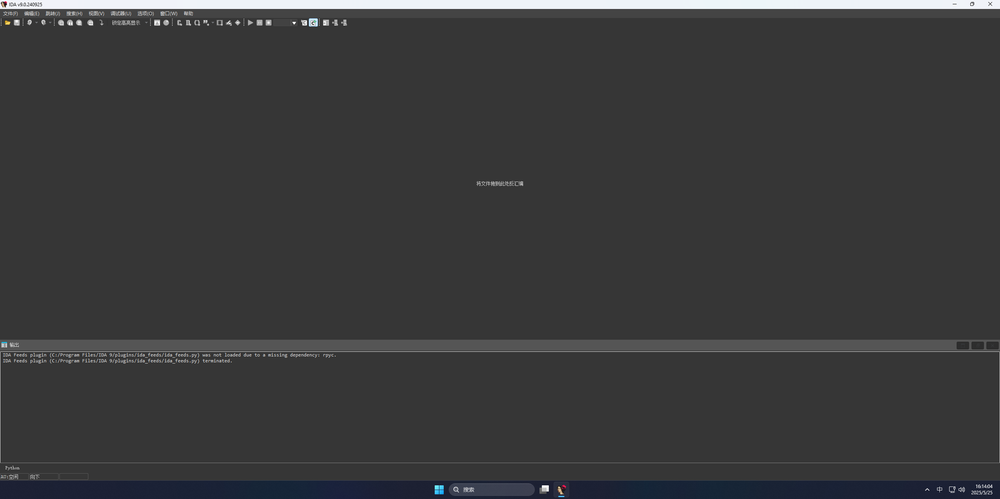
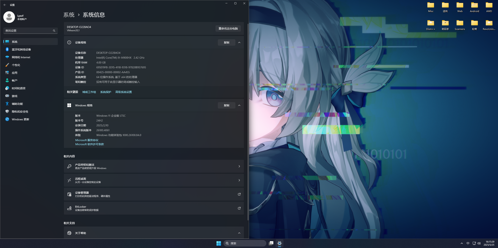

# WheelChair OS 使用手册

## 1. 项目简介

### 1.1 WheelChair OS 简介

WheelChair OS 是一个为 CTF 竞赛和渗透测试设计的虚拟机环境。它集成了大量用于网络安全、漏洞分析、代码审计和加密解密的工具，旨在为安全研究人员和 CTF 竞赛参与者提供一个全面、高效的工作平台。

### 1.2 获取WheelChair OS

WheelChair OS 的虚拟机镜像文件可以从指定的下载链接获取。请确保您使用的虚拟机软件（如 VMware）支持导入 `.vmdk` 格式的虚拟机镜像。

下载地址 [OneDrive](https://1drv.ms/u/c/5072269c7a7138cf/EZJEuR3XVD5NkmO_dkWitIABTfMsZlI8djYDHk91wFgWFA?e=A8Hm7i)

密码 `We are all living passionately`

### 1.3 演示照片

## 2. 使用声明

### 2.1 使用目的

本虚拟机仅供内部学习和研究目的使用，不得用于任何商业用途。

### 2.2 软件授权

虚拟机中预装的软件可能未获得合法授权。使用本虚拟机的用户需自行承担使用未授权软件的法律风险。

根据《计算机软件保护条例》第十七条的规定，为了学习和研究软件内含的设计思想和原理，通过安装、显示、传输或者存储软件等方式使用软件的，可以不经软件著作权人许可，不向其支付报酬。

请在下载本虚拟机后24小时内删除本虚拟机，或在使用过程中遵循以下原则:

1. 不得将本虚拟机用于商业用途。
2. 不得将本虚拟机用于任何违法活动。
3. 不得将本虚拟机用于侵犯他人知识产权的活动。
4. 不得将本虚拟机用于任何可能导致法律责任的活动。
5. 不得将本虚拟机用于任何可能导致他人损失的活动。
6. 不得将本虚拟机用于任何可能导致他人隐私泄露的活动。
7. 不得将本虚拟机用于任何可能导致他人信息安全风险的活动。

### 2.3 责任承担

若因使用本虚拟机中的未授权软件导致侵权或其他法律问题，由使用者自行承担责任。

## 3. 虚拟机环境介绍

| **配置项**           | **描述**                                  |
| -------------------- | ----------------------------------------- |
| **操作系统**         | Windows 11 LSTC 版                        |
| **软件包管理器**     | Winget 已安装并配置                       |
| **应用商店**         | Microsoft Store 已安装并配置              |
| **Python 版本**      | Python 3.11                               |
| **Java 版本**        | Microsoft OpenJDK 21.0.6 LTS (2025-01-21) |
| **JavaFX 环境**      | 已安装并配置                              |
| **GoLang 版本**      | 最新版                                    |
| **Windows Update**   | 已推迟到 2038 年，可手动更新              |
| **Windows Defender** | 已删除                                    |
| **Windows 杂项服务** | 已删除                                    |

桌面有 3 个 bat 文件，分别为：

- **clean-logs.bat**：删除系统日志。
- **clean-data.bat**：删除系统临时文件和渗透工具日志。
- **run_with_javafx.bat**：补全 javafx 运行环境。

系统附带了以下工具：

- **NeatDownloadManager**：用于下载文件。
- **Sharex**：用于截图。
- **DawnLauncher**：用于快速启动工具。
- **VSCode**：用于编辑代码。
- **Everything**：用于搜索文件。

## 4.虚拟机环境介绍

### Android

| 软件名称             | 介绍                                                       | 来源    |
| :------------------- | :--------------------------------------------------------- | :------ |
| APK.Tool.GUI-3.3.1.5 | 一款用于分析 APK 文件的工具，常用于逆向工程。              | Github  |
| ApkScan-PKID查壳工具 | 用于检测 APK 文件是否加壳以及加壳类型。                    | Github  |
| GDA-4.11             | 用于反编译 APK 文件的工具，速度快，适合快速查看 APK 内容。 | 52pojie |
| Jadx                 | 一款开源的 APK 反编译工具。                                | Github  |
| jar-analyzer-4.3     | 用于分析 Java 类文件和 JAR 包的工具。                      | Github  |
| JEB-5.22             | 用于分析 APK 文件的工具。                                  | 52pojie |

### AWD

| 软件名称                         | 介绍                                            | 来源   |
| :------------------------------- | :---------------------------------------------- | :----- |
| electerm-1.70.6-win-x64-portable | 一款集成了 SSH、SFTP、Telnet 等功能的终端工具。 | Github |
| FileZilla_3.68.1_win64           | 一款流行的文件传输工具。                        | 官网   |
| Seay源码审计工具                 | 一款用于代码质量分析的工具。                    | 网络   |
| Fortify                          | 一款代码后门审计工具。                          | ddosi  |
| D盾                              | 一款代码后门审计工具。                          | 网络   |

### Scanners

| 软件名称            | 介绍                            | 来源    |
| :------------------ | :------------------------------ | :------ |
| afrog               | 一款用于 Web 安全扫描的工具。   | Github  |
| ffuf                | 一款快速 Web Fuzzing 工具。     | Github  |
| fscan               | 一款多功能网络扫描工具。        | Github  |
| Acunetix            | 一款商业 Web 应用安全扫描工具。 | Pwn3rzs |
| goby-win-x64-2.9.10 | 一款智能 Web 扫描工具。         | 官网    |
| Netsparker          | 一款商业 Web 应用安全扫描工具。 | Pwn3rzs |
| OneLong             | 一款 Web 安全扫描工具。         | Github  |
| scaninfo            | 一款用于收集目标信息的工具。    | Github  |
| xpoc                | 一款用于漏洞验证的工具。        | Pwn3rzs |
| xray                | 一款用于 Web 安全扫描的工具。   | Pwn3rzs |

### Web

| 软件名称          | 介绍                                                         | 来源     |
| :---------------- | :----------------------------------------------------------- | :------- |
| Burpsuite         | 一款用于 Web 安全测试的工具。                                | 官网     |
| bypass-403        | 一款用于绕过 Web 403 错误的工具。                            | Github   |
| jwt_tool          | 一款用于分析和篡改 JWT 的工具。                              | Github   |
| railgun           | 一款安全工具，用于检测和利用某些安全漏洞。                   | Github   |
| Struts2           | 一款用于 Struts2 漏洞利用的工具。                            | Github   |
| Venom-JWT         | 一款用于生成和篡改 JWT 的工具。                              | Github   |
| WEB-EXP-TOOLS     | 包含一些用于 Web 漏洞利用的工具，如针对 NACOS、OA 漏洞等。   | 自行收集 |
| WEB-RCE           | 包含一些用于远程代码执行（RCE）的工具，如 AntSword、godzilla 等。 | 自行收集 |
| WEB-Scanners      | 包含一些 Web 扫描工具，如 WEB-DirScan、WEB-Gitleak 等。      | 自行收集 |
| WEB-SQL           | 包含 Sqlmap，用于自动化 SQL 注入攻击。                       | 自行收集 |
| WEB-SSTI          | 包含 Fenjing，用于检测 SSTI 漏洞。                           | 自行收集 |
| WEB-XSS           | 包含 XSStrike，用于检测 XSS 漏洞。                           | 自行收集 |
| webshell_personal | 包含一些个人使用的 Webshell 工具。                           | 自行收集 |

### WEB-EXP-TOOLS

| 软件名称            | 介绍                              | 功能描述                                                   | 来源     |
| :------------------ | :-------------------------------- | :--------------------------------------------------------- | :------- |
| Java-ALL            | 用于 Java 相关漏洞的利用工具。    | 包含多种 Java 应用漏洞的利用脚本和工具。                   | 自行收集 |
| NACOS               | 用于 NACOS 漏洞的利用工具。       | 包含针对 NACOS 平台的漏洞利用脚本，如 RCE 漏洞。           | 自行收集 |
| OA漏洞综合          | 用于 OA 系统漏洞的利用工具。      | 包含多种 OA 系统（如泛微、致远等）的漏洞利用工具。         | 自行收集 |
| RuoYi               | 用于 RuoYi 漏洞的利用工具。       | 包含针对 RuoYi 平台的漏洞利用脚本。                        | Github   |
| ThinkPHP            | 用于 ThinkPHP 漏洞的利用工具。    | 包含针对 ThinkPHP 框架的漏洞利用工具，如远程代码执行漏洞。 | Github   |
| TongdaOA            | 用于通达 OA 漏洞的利用工具。      | 包含针对通达 OA 系统的漏洞利用工具。                       | Github   |
| Weblogic            | 用于 Weblogic 漏洞的利用工具。    | 包含针对 Weblogic 中间件的漏洞利用工具，如 RCE 漏洞。      | Github   |
| WeblogicExploit-GUI | Weblogic 漏洞利用的图形界面工具。 | 提供图形界面操作，方便利用 Weblogic 漏洞。                 | Github   |
| xxl-job             | 用于 xxl-job 漏洞的利用工具。     | 包含针对 xxl-job 平台的漏洞利用脚本。                      | Github   |
| YongYouNc           | 用于用友 NC 漏洞的利用工具。      | 包含针对用友 NC 系统的漏洞利用工具。                       | Github   |

### WEB-RCE

| 软件名称      | 介绍                      | 来源     |
| :------------ | :------------------------ | :------- |
| AntSword      | 一款 Webshell 管理工具。  | Github   |
| godzilla      | 一款 Webshell 管理工具。  | Github   |
| ImageWebshell | 一款基于图片的 Webshell。 | 自行收集 |

### WEB-Scanners

| 软件名称           | 介绍                              | 来源   |
| :----------------- | :-------------------------------- | :----- |
| WEB-DirScan        | 一款 Web 目录扫描工具。           | Github |
| WEB-Gitleak        | 一款 Git 仓库泄露检测工具。       | Github |
| WEB-SpringbootScan | 用于 Spring Boot 应用的扫描工具。 | Github |
| WEB-ThinkPHPScan   | 用于 ThinkPHP 漏洞的扫描工具。    | Github |

### WEB-SQL

| 软件名称 | 介绍                      | 来源   |
| :------- | :------------------------ | :----- |
| Sqlmap   | 一款自动化 SQL 注入工具。 | Github |

### WEB-SSTI

| 软件名称 | 介绍                       | 来源   |
| :------- | :------------------------- | :----- |
| Fenjing  | 用于检测 SSTI 漏洞的工具。 | Github |

### WEB-XSS

| 软件名称 | 介绍                      | 来源   |
| :------- | :------------------------ | :----- |
| XSStrike | 用于检测 XSS 漏洞的工具。 | Github |

### Crypto

| 软件名称             | 介绍                          | 来源  |
| :------------------- | :---------------------------- | :---- |
| 轩禹CTF_RSA工具3.6.1 | 一款用于 RSA 加密分析的工具。 | Gitee |

### 逆向

| 软件名称                               | 介绍                           | 来源    |
| :------------------------------------- | :----------------------------- | :------ |
| die_winxp_portable_3.10_x86            | 一款便携版的文件分析工具。     | 52pojie |
| dnSpy-net-win64                        | 一款用于分析 .NET 程序的工具。 | Github  |
| ExeinfoPE                              | 一款用于分析 PE 文件的工具。   | Github  |
| X64dbg                                 | 一款用于调试 x64 程序的工具。  | Github  |
| Xways Winhex 19.8 Professional License | 一款专业的十六进制编辑器。     | 看雪    |
| IDA 9.0                                | 一款专业的反编译工具。         | 看雪    |
| IDA 9.0汉化版                          | 一款专业的反编译工具。         | 52pojie |

### 轮椅

| 软件名称                 | 介绍                    | 来源   |
| :----------------------- | :---------------------- | :----- |
| ctftools-all-in-one V2.5 | 一款多功能的 CTF 工具。 | Github |

### 杂项

| 软件名称   | 介绍                                                | 来源     |
| :--------- | :-------------------------------------------------- | :------- |
| 二维码工具 | 包含 qrazybox、qrazybox-cn 等二维码生成和解析工具。 | 自行收集 |
| 压缩包工具 | 包含 ARCHPR、bkcrack、ZipCracker 等压缩包分析工具。 | 自行收集 |
| 图片工具   | 包含 BlindWatermark、exiftool 等图片处理工具。      | 自行收集 |
| 音频工具   | 包含 audacity、dtmf2num 等音频处理工具。            | 自行收集 |
| 流量分析   | 包含 BlueTeamToolsV1.43 等用于流量分析的工具。      | 自行收集 |
| 编码工具   | 包含 CyberChef 等用于编码解码的工具。               | 自行收集 |

### 二维码工具

| 软件名称    | 介绍                                 | 来源   |
| ----------- | ------------------------------------ | :----- |
| qrazybox    | 一款二维码生成和解析工具。           | Github |
| qrazybox-cn | 一款二维码生成和解析工具（中文版）。 | 自研   |
| QR_Research | 用于二维码研究和分析的工具。         | Github |

### 压缩包工具

| 软件名称                     | 介绍                         | 来源     |
| ---------------------------- | ---------------------------- | :------- |
| ARCHPR_4.66.266.0_汉化绿色版 | 一款压缩包分析工具。         | 来源不明 |
| bkcrack-1.7.1-win64          | 一款压缩包已知明文破解工具。 | Github   |
| ZipCracker                   | 一款 ZIP 压缩包破解工具。    | Github   |

### 图片工具

| 软件名称             | 介绍                                  | 来源    |
| -------------------- | ------------------------------------- | :------ |
| BlindWatermark       | 一款盲水印工具。                      | 52pojie |
| exiftool-13.21_64    | 一款图片元数据编辑工具。              | 52pojie |
| GifSplitter 2.0      | 一款 GIF 图片分割工具。               | 52pojie |
| LSB                  | 一款基于最低有效位（LSB）的隐写工具。 | 52pojie |
| Outguess             | 一款隐写术工具。                      | 52pojie |
| pngcheck-2.3.0-win32 | 一款 PNG 图片检查工具。               | 官网    |
| puzzlesolve          | 一款图片拼图解决工具。                | 官网    |

### 音频工具

| 软件名称 | 介绍                     | 来源     |
| -------- | ------------------------ | :------- |
| audacity | 一款音频编辑工具。       | 官网     |
| dtmf2num | 一款 DTMF 信号分析工具。 | 来源不明 |
| MP3Stego | 一款 MP3 隐写工具。      | 来源不明 |
| RX-SSTV  | 一款SSTV解码工具。       | 官网     |

### 流量分析

| 软件名称           | 介绍                               | 来源   |
| ------------------ | ---------------------------------- | :----- |
| BlueTeamToolsV1.43 | 一款用于流量分析的工具。           | Github |
| CTF-NetA-V0.3.0    | 一款用于网络攻防竞赛的流量分析工具 | Github |
| Wireshark          | 一款网络协议分析工具。             | 官网   |

### 编码工具

| 软件名称             | 介绍                          | 来源   |
| -------------------- | ----------------------------- | :----- |
| CyberChef_v10.19.4   | 一款多功能编码解码工具。      | Github |
| SRK_Toolbox_v10.19.4 | 一款汉化版的 CyberChef 工具。 | Github |

## 5. 安装与部署指南

### 5.1 下载与导入

1. 从指定的下载链接获取 WheelChair OS 的虚拟机镜像文件（通常是 `.vmx` 格式）。
2. 打开您的VMware。
3. 在 VMware 中，选择“文件”>“打开”，然后选择下载的 `.vmdk` 文件并完成导入。

### 5.2 首次启动配置

1. 启动虚拟机后，选择“我已复制该虚拟机”。
2. 设置管理员账户的用户名和密码（默认无密码）。
3. 配置网络设置，建议选择“桥接模式”以方便与宿主机通信。
4. 完成初始设置后，登录系统并检查桌面的工具和快捷方式。

## 6.致谢

WheelChair OS 的构建离不开众多优秀软件的支持。在此，我们衷心感谢以上软件的开发者和提供者，他们的工具为我们的项目提供了强大的技术支持。

感谢每一位软件开发者和维护者的辛勤付出，你们的努力让 WheelChair OS 能够集成如此多优秀的工具，为用户提供一个全面、高效的学习和研究平台。

感谢对以上破解版软件进行破解和增强修改的所有逆向大佬，你们的分享精神使得更多人可以享受到优秀软件带来的便利。

## 7.赞助我们

WheelChair OS 是一个专为网络安全竞赛（CTF）、渗透测试和安全研究量身打造的虚拟机环境。它集成了大量前沿的工具和资源，旨在为安全研究人员、CTF 竞赛参与者以及网络安全爱好者提供一个全面、高效的学习与研究平台。通过整合各类专业工具，WheelChair OS 帮助用户快速上手，深入探索网络安全的各个领域。

维护 WheelChair OS 并保持内部软件的持续更新是一项艰巨的任务。我们投入了大量精力用于封装工具并进行测试，以确保为用户提供高质量的使用体验。然而，这一切都需要资源支持。

为了更好地维持和发展 WheelChair OS，我们仅接受用户赞助。您的支持将帮助我们继续优化工具并引入更多功能。

**赞助方式**：

如果您愿意支持 WheelChair OS，请通过支付宝红包的方式进行赞助。您可以将支付宝红包口令发送至我们的邮箱：lyscf#proton.me

您的每一份支持都对我们至关重要，感谢您的理解与帮助！